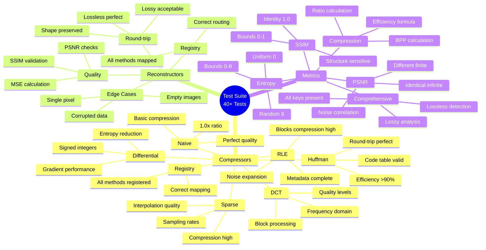

# Shannon Portrait - Architecture Diagrams

This document contains Mermaid diagrams visualizing the Shannon Portrait project architecture.

---

## 📊 Diagram 1: System Architecture Overview


**Description**: High-level system architecture showing the main components:
- **User Interfaces**: CLI and Streamlit UI as entry points
- **Core Engine**: Compression/reconstruction algorithms and metrics
- **Data Layer**: Utilities for data handling
- **External Services**: LLM integration via OpenRouter

---

## 📊 Diagram 2: Compression & Reconstruction Workflow


**Description**: Complete data flow from input to output:
1. **Input**: Original 2D image
2. **Encoding**: Multiple compression methods available
3. **Transmission**: 1D byte stream (simulated wire)
4. **Decoding**: Method-specific reconstruction
5. **Output**: Reconstructed 2D image
6. **Analysis**: Quality metrics comparing input/output

---

## 📊 Diagram 3: Information Theory Metrics Flow

```mermaid
graph TD
    subgraph "Original Image Analysis"
        A[Original Image<br/>H × W pixels]
        B[Calculate Entropy<br/>H = -Σ p·log₂p]
        C[Theoretical Minimum<br/>Min bits = H × pixels]
        A --> B --> C
    end
    
    subgraph "Compression Analysis"
        D[Compressed Data<br/>N bytes]
        E[Calculate<br/>• Bits per pixel<br/>• Compression ratio<br/>• Space saved]
        F[Efficiency<br/>η = Theoretical/Actual]
        D --> E --> F
    end
    
    subgraph "Quality Analysis"
        G[Original vs<br/>Reconstructed]
        H[PSNR<br/>10·log₁₀MAX²/MSE]
        I[SSIM<br/>Structural Similarity]
        J[MSE<br/>Mean Squared Error]
        G --> H & I & J
    end
    
    subgraph "Shannon's Limits"
        K{Is Lossless?}
        K -->|Yes| L[PSNR = ∞<br/>Perfect reconstruction<br/>Cannot compress below H]
        K -->|No| M[PSNR finite<br/>Rate-distortion tradeoff<br/>Quality vs Size]
    end
    
    subgraph "Results Dashboard"
        N[Comprehensive Report<br/>• Entropy reduction<br/>• Compression efficiency<br/>• Quality metrics<br/>• Theoretical vs actual]
    end
    
    C --> F
    F --> N
    H & I & J --> K
    K --> N
    L --> N
    M --> N
    
    style B fill:#ff6b6b
    style C fill:#ee5a6f
    style F fill:#4ecdc4
    style H fill:#95e1d3
    style I fill:#f38181
    style K fill:#aa96da
    style N fill:#fcbad3
```



**Description**: Information theory metrics calculation and Shannon's theoretical bounds:
- **Entropy**: Sets theoretical compression limit
- **Efficiency**: How close algorithm is to theoretical optimum
- **Quality Metrics**: Quantify reconstruction quality
- **Shannon's Limits**: Distinguish lossless vs lossy compression

---

## 📊 Diagram 4: Streamlit UI State Management


**Description**: Streamlit UI state transitions and data flow:
- **Settings**: Global configuration (persists in session_state)
- **Encode**: Compression with state management
- **Decode**: Reconstruction using encoded data from session
- **Diff**: Analysis using both encoded and decoded data
- **Summarize**: LLM report generation (optional)

---

## 📊 Diagram 5: Extensibility Architecture


**Description**: Class hierarchy showing extensibility design:
- **Abstract Base Classes**: Media-agnostic interfaces
- **Image Classes**: Current implementations (6 compressors)
- **Audio/Text Classes**: Future extensions (architecture ready)
- **Inheritance**: Clear separation of concerns

---

## 📊 Diagram 6: CLI Command Flow


**Description**: Sequence diagram showing CLI command execution:
1. **Encode**: Auto-detection → Compression → File save
2. **Decode**: Metadata read → Reconstruction → Image save
3. **Benchmark**: Multiple compressions → Comparison
4. **UI**: Launch Streamlit server

---

## 📊 Diagram 7: Test Coverage Map



**Description**: Mind map of test coverage:
- **Compressors**: All 6 methods tested thoroughly
- **Reconstructors**: Round-trip and quality validation
- **Metrics**: Shannon entropy, PSNR, SSIM, efficiency
- **Edge Cases**: Empty, single-pixel, corrupted data

---

## 🎨 How to Use These Diagrams

### In Documentation
Copy the mermaid code blocks into:
- GitHub README.md (renders automatically)
- Documentation sites (GitBook, ReadTheDocs, etc.)
- Jupyter notebooks (with mermaid extension)

### In Presentations
1. Render diagrams using:
   - Mermaid Live Editor: https://mermaid.live
   - VS Code Mermaid extension
   - GitHub markdown preview

2. Export as PNG/SVG for:
   - PowerPoint presentations
   - Academic papers
   - Project proposals

### For Development
- **Architecture Planning**: Reference during design discussions
- **Onboarding**: Help new contributors understand structure
- **Debugging**: Trace data flow through system
- **Documentation**: Keep diagrams updated with code changes

---

## 📝 Diagram Maintenance

### When to Update

**Diagram 1 (System Architecture)**: When adding new major components
**Diagram 2 (Workflow)**: When adding new compression methods
**Diagram 3 (Metrics)**: When adding new metrics
**Diagram 4 (UI State)**: When adding new pages
**Diagram 5 (Extensibility)**: When adding new base classes
**Diagram 6 (CLI Flow)**: When changing CLI commands
**Diagram 7 (Test Coverage)**: After adding new tests

### Quick Edit Guide

```bash
# Edit this file
vim DIAGRAMS.md

# Preview in VS Code (install Mermaid extension)
code DIAGRAMS.md

# Render online
# Copy code block → https://mermaid.live

# Commit changes
git add DIAGRAMS.md
git commit -m "Update architecture diagrams"
```

---

## 🎓 Educational Use

These diagrams are perfect for:

1. **Teaching Information Theory**
   - Show Diagram 3 for Shannon's metrics
   - Use Diagram 2 for compression workflow

2. **Software Architecture Courses**
   - Diagram 1 for system design
   - Diagram 5 for extensibility patterns

3. **Research Presentations**
   - Diagram 2 for methodology
   - Diagram 3 for theoretical framework

4. **Project Documentation**
   - All diagrams for comprehensive docs
   - Diagram 6 for user guide

---

*These diagrams visualize the complete Shannon Portrait architecture, from high-level system design to detailed workflows and test coverage.*

**Shannon Portrait - Information Coding & Encoding**
**Built with Claude (Anthropic) • February 2025**
